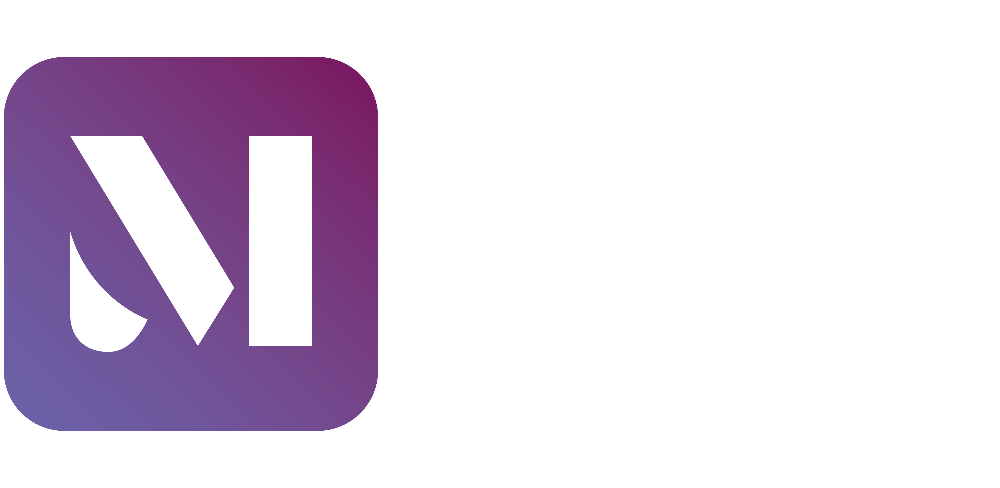

<a href="https://mycustomnotes.nicolasferrada.com/">
  <h1 align="center">
    <picture>
      
    </picture>
  </h1>
</a>

## Organize your day and save your favorite moments in one place!

Simplify your day by effortlessly managing your to-dos, capturing valuable thoughts, ideas, and cherished moments. You can create customizable text and task notes, including the ability to save links to your preferred websites. Organize your digital life with ease by using folders to categorize and access your notes efficiently.

## Video

Click on the image to see a brief demonstration of the app!

  

## Where to get the app?
My Custom Notes is available for:

- **[Google Play](https://play.google.com/store/apps/details?id=com.nicolasferrada.mycustomnotes)** for Android.
- **[App Store](https://apps.apple.com/us/app/my-custom-notes/id6469385680?platform=iphone)** for IOS.

## Technologies
 
 

- **Dart** as the programming language.

- **Flutter** as the framework.

- **Firebase** as the back-end.

## Major technical components

- Sign in with email/password, Google, and Apple.

- Account operations and configurations based on the login provider.

- Push notifications.
        
- Offline mode.

- Local storage.

- Translation to multiple languages.

- Deleting all user's data on request.

- Exporting user's data.

## Project story
After obtaining a computer science (CS) degree in mid-2022, I began working on some small Flutter projects that didn't seem to lead anywhere. In November 2022, I decided to follow a promising tutorial that lasted for a day and a half. This was aimed at strengthening my foundational knowledge of Flutter.

  

After completing approximately 25 hours of the course, I became enthusiastic about adding new features to the application. A year later, this is the final result.
 
I wouldn't recommend using a learning project to create a final product.

## Major known issues
The software foundations are inconsistent, making the project unsustainable for the long term.

#### **State management** 
I initially believed I would complete the project within a few months, so I decided that refactoring the existing code to add a solid state management approach would be a waste of time. This turned out to be a poor decision and is the primary reason why the project lacks scalability.

#### **Boilerplate code** 
There is a significant amount of boilerplate code. This is primarily due to the absence of a clear state management system.

#### **Testing** 
No testing beyond using real devices was performed.

#### **Planning**
The project started as a learning project, so it did not have any planning.

## Acknowledgements
This project was a valuable learning experience and it significantly improved my knowledge. I am thankful for the opportunity it provided to enhance my skills.
